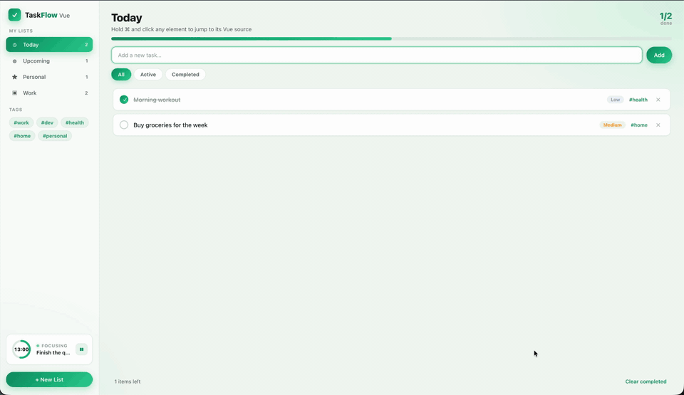

# ide-byebye

[English](./README.md) | [中文](./README.zh-CN.md)

> ⌘-click any rendered element, describe the change in plain words, and hand
> **source location + intent** to **Codex App / Claude App / Cursor / Grok Build**
> — no hunting through the IDE.

Dev-only multi-bundler plugin (Vite / webpack / rspack / rsbuild / esbuild /
Farm; Turbopack & Mako for path injection). It overlays a source-aware picker on
your running app, builds a structured prompt (`file:line`, surrounding source,
intent, optional screenshots / styles / recording), and opens the chosen agent
via deeplink or Terminal.

It is glue, not a model: it never edits files and ships no AI SDK. The agent you
hand off to does the actual change.

---



**What the clip shows** (Vue demo → agent):

1. **Pick** — hold ⌘ and click a rendered node; the overlay resolves
   `data-insp-path` to source (`src/App.vue #99-129` in the recording).
2. **Describe** — type plain-language intent in the dialog (optional `@code`,
   screenshots, styles, or recording).
3. **Hand off** — choose **Codex App / Claude App / Cursor / Grok Build**;
   the loopback server builds a structured prompt and opens the agent with
   `file:line` + intent already filled in.

---

## Table of contents

- [How it works](#how-it-works)
- [Install](#install)
- [Quick start](#quick-start)
- [Demo](#demo)
- [Requirements](#requirements)
- [The intent dialog](#the-intent-dialog)
- [Configuration reference](#configuration-reference)
  - [Minimal config](#minimal-config)
  - [Optional options (one by one)](#optional-options-one-by-one)
  - [Agents](#agents)
  - [Recording (rrweb)](#recording-rrweb)
- [Artifacts](#artifacts)
- [Localization](#localization)
- [Security & privacy](#security--privacy)
- [Build from source](#build-from-source)
- [License](#license)

---

## How it works

1. **Pick** — hotkey (default `Alt+Shift+I`) or hold `clickModifier` (⌘ / Ctrl)
   and click. Source comes from `data-insp-path` injected by
   [`code-inspector-plugin`](https://github.com/zh-lx/code-inspector).
2. **Describe** — intent dialog opens on the element. Optionally add `@code`
   refs, screenshots, computed styles, or an interaction recording.
3. **Hand off** — click **Codex App / Claude App / Cursor / Grok Build**. The
   local loopback server (`127.0.0.1`, per-process token) builds the prompt and
   opens the agent (deeplink or Terminal).

Nothing leaves your machine except the deeplink you trigger. Bundler adapters
only inject the bootstrap into HTML.

## Install

```sh
npm i -D ide-byebye code-inspector-plugin
```

`code-inspector-plugin` is a dependency (also listed so you can pin it). Without
it, elements have no source mapping and the picker shows *"no source mapping"*.

Optional — element-behavior recording (on by default, lazy-loaded):

```sh
npm i -D @rrweb/record @rrweb/replay
```

Disable with `recording: false` if you don't need it.

## Quick start

### Vite (default export)

```js
// vite.config.js
import { defineConfig } from 'vite';
import react from '@vitejs/plugin-react'; // or @vitejs/plugin-vue
import ideByebye from 'ide-byebye';       // same as 'ide-byebye/vite'

export default defineConfig({
  plugins: [
    // Zero-config: registers code-inspector, ⌘/Ctrl-click pick,
    // all footer agents + clipboard/file, recording on, Enter → Claude App.
    ideByebye(),
    react(),
  ],
});
```

### Other bundlers

Import the matching subpath — **never** pass a `bundler` string yourself:

| Bundler | Import | Notes |
| --- | --- | --- |
| **Vite** | `ide-byebye` / `ide-byebye/vite` | Full zero-config (default). |
| **webpack** | `ide-byebye/webpack` | Injects into HtmlWebpackPlugin output. |
| **rspack** | `ide-byebye/rspack` | Same shape as webpack. |
| **rsbuild** | `ide-byebye/rsbuild` | `plugins: [inspector()]`. |
| **esbuild** | `ide-byebye/esbuild` | Pass `htmlFiles: ['./index.html']` if HTML is not in `outdir`. |
| **Farm** | `ide-byebye/farm` | Returns `[codeInspector, inspector]` — spread into Farm plugins. |
| **Turbopack** (Next) | `ide-byebye/turbopack` | Rules only (`data-insp-path`); mount bootstrap yourself. |
| **Mako** (Umi) | `ide-byebye/mako` | Same as Turbopack — path injection only. |

```js
// webpack.config.js
import inspector from 'ide-byebye/webpack';
export default {
  plugins: [new HtmlWebpackPlugin({ template: './index.html' }), inspector()],
};
```

```js
// rsbuild.config.ts
import { defineConfig } from '@rsbuild/core';
import inspector from 'ide-byebye/rsbuild';
export default defineConfig({ plugins: [inspector()] });
```

```js
// esbuild
import * as esbuild from 'esbuild';
import inspector from 'ide-byebye/esbuild';
await esbuild.context({
  entryPoints: ['src/main.jsx'],
  bundle: true,
  outdir: 'dist',
  plugins: inspector({ htmlFiles: ['./index.html'] }),
});
```

Override only what you need:

```js
ideByebye({
  defaultAgent: 'codex-app', // Enter key → one of the four footer agents
  agents: {
    cursorApp: { workspace: 'my-app' },
    grokBuild: { permissionMode: 'plan' },
    codexApp: false,  // hide a footer agent
    file: false,      // disable backend agent (clipboard / file)
  },
  recording: false,
});
```

> Default export and named export `codeIntentInspectorPlugin` are the same
> (Vite). Use whichever you prefer.

### Vue

DOM → source mapping works for Vue 2/3 SFCs via code-inspector. Prompt context
for `.vue` is best-effort (template line slice, not a full Vue AST). JSX/TSX
still get the richer AST path. See [`demo/vue`](./demo/vue).

## Demo

Playground under [`demo/`](./demo) (React + Vue × Vite / webpack / rspack):

```sh
cd demo && pnpm install
pnpm dev                 # react + vite
pnpm dev:vue             # vue + vite
pnpm dev:react:webpack
pnpm dev:react:rspack
```

Hold ⌘ and click any element to open the intent dialog. Details:
[`demo/README.md`](./demo/README.md).

## Requirements

- **Bundler** — Vite `>=4`, webpack `>=5`, rspack, rsbuild, esbuild, or Farm for
  full zero-config. Turbopack / Mako only inject `data-insp-path`.
- **`code-inspector-plugin`** — registered by the adapters above; no manual setup.
- **macOS** for footer agents out of the box (`open` for deeplinks / launchers).
  On Linux/Windows set `openCommand` per agent (see [Shared footer-agent options](#shared-footer-agent-options)).
- **Target agent installed** — Codex App / Claude App / Cursor /
  [Grok Build CLI](https://x.ai/cli). No extra npm deps for these agents.

## The intent dialog

| Feature | What it does |
| --- | --- |
| **Element pick** | ⌘-click (or hotkey + click). Re-resolves `data-insp-path` after SPA re-renders. |
| **Mention editor** | Rich contenteditable; picked element is a pinned primary reference. Empty intent OK if you attach refs. |
| **`@code` references** | Pick another element → inline `@file #range` at caret. Deduped; order preserved. |
| **Screenshots** | `selection` / `parent` / `viewport` (multi-select). Persisted as UI preference. |
| **Rendered styles** | Curated computed CSS (~110 props), element or ancestor chain. Opt-in; read at send time. |
| **Recording** | rrweb element-behavior capture + still frame. On by default; needs `@rrweb/*`. |
| **Pin** | Collapse to a floating orb across pages. Warm restore keeps attachments; full reload keeps text only. |

## Configuration reference

`ideByebye(options)` — **every option is optional**. Invalid values fall back to
the defaults below.

### Minimal config

```js
// vite.config.js
import ideByebye from 'ide-byebye';

export default {
  plugins: [ideByebye()],
};
```

Empty call is enough. You get:

| Behavior | Default |
| --- | --- |
| Plugin on | `enabled: true` (dev only) |
| Pick | hold ⌘ (macOS) / Ctrl → click; hotkey `Alt+Shift+I` |
| Enter handoff | **Claude App** |
| Footer agents | Codex App / Claude App / Cursor / Grok Build — all on |
| Backend agents | clipboard + file — on (via Enter / `defaultAgent`) |
| Recording | on (needs `@rrweb/record` + `@rrweb/replay`) |
| UI locale | auto (`navigator.language` → else `zh`) |
| Handoff files | `.intent-inspector/` |
| Source `@` paths | relative; screenshot / still paths absolute |
| code-inspector | registered for you (`pathType: 'absolute'`, its own hotkeys off) |

Override only what you need:

```js
ideByebye({
  defaultAgent: 'cursor-app',
  locale: 'en',
  recording: false,
  agents: {
    codexApp: false,
    cursorApp: { workspace: 'my-app' },
  },
});
```

### Optional options (one by one)

#### `enabled`

| | |
| --- | --- |
| **Type** | `boolean` |
| **Default** | `true` |
| **Set to** | `false` to fully disable (no server, no inject). Anything else stays on. |

#### `locale`

| | |
| --- | --- |
| **Type** | `'zh' \| 'en'` |
| **Default** | auto — `config.locale` → `navigator.language` → `zh` |
| **Set to** | `'zh'` / `'en'`, or any string starting with `zh` → Chinese, else English. Prompt text and brand names are **not** localized. |

#### `hotkey`

| | |
| --- | --- |
| **Type** | `string` |
| **Default** | `'Alt+Shift+I'` |
| **Set to** | `+`-joined combo, case-insensitive. Modifiers: `alt`/`option`, `shift`, `ctrl`/`control`, `meta`/`cmd`/`command`. Last token is the key. Toggles the picker. |

#### `clickModifier`

| | |
| --- | --- |
| **Type** | `string \| null \| false` |
| **Default** | `'auto'` → ⌘ on macOS, Ctrl elsewhere |
| **Set to** | `'meta'` / `'ctrl'` / `'alt'` / `'shift'` to force a modifier; `null` / `false` disables click-to-pick (hotkey still works). |

#### `defaultAgent`

| | |
| --- | --- |
| **Type** | `string` |
| **Default** | `'claude-app'` |
| **Set to** | Enter-key target: `'codex-app'` / `'claude-app'` / `'cursor-app'` / `'grok-build'` (or `'clipboard'` / `'file'`). Unknown / disabled values fall back to the first enabled agent. |

#### `applyMode`

| | |
| --- | --- |
| **Type** | `'prompt-only' \| 'agent-edit'` |
| **Default** | `'prompt-only'` |
| **Set to** | Hint embedded in the handoff: propose a plan only vs. allow the agent to edit. |

#### `outputDir`

| | |
| --- | --- |
| **Type** | `string` |
| **Default** | `'.intent-inspector'` |
| **Set to** | Project-relative dir for `file` agent / `promptMode: 'file'` / overflow handoffs. Must stay inside the project root. Add it to `.gitignore`. |

#### `maxSourceContextLines`

| | |
| --- | --- |
| **Type** | `number` |
| **Default** | `60` |
| **Set to** | How many source lines around the mapped location go into the prompt. |

#### `maxDomSnippetLength`

| | |
| --- | --- |
| **Type** | `number` |
| **Default** | `1000` |
| **Set to** | Max characters of the captured DOM/HTML snippet. |

#### `apiOrigin`

| | |
| --- | --- |
| **Type** | `string \| null` |
| **Default** | auto (loopback inspector origin) |
| **Set to** | Absolute `http(s)://…` origin (no trailing slash) if the page must talk to a non-default inspector host. Invalid values → auto. |

#### `pathStyle`

| | |
| --- | --- |
| **Type** | `'relative' \| 'absolute'` |
| **Default** | `'relative'` |
| **Set to** | How **source** paths appear in plain `@` prompts (clipboard / file / Grok). For Grok monorepos prefer `agents.grokBuild.projectRoot` over forcing absolute. |

#### `artifactPathStyle`

| | |
| --- | --- |
| **Type** | `'relative' \| 'absolute'` |
| **Default** | `'absolute'` |
| **Set to** | How screenshot / recording still paths appear in `@` prompts. Absolute so agents can open images regardless of cwd; use `'relative'` only if you know the agent cwd. |

#### `recording`

| | |
| --- | --- |
| **Type** | `boolean \| object` |
| **Default** | on — see [Recording (rrweb)](#recording-rrweb) |
| **Set to** | `false` / `{ enabled: false }` to hide Record; or an object to tune buffer / mask. |

#### `agents`

| | |
| --- | --- |
| **Type** | `object` |
| **Default** | `{}` (all six agents **on**) |
| **Set to** | Per-agent enable / overrides — see [Agents](#agents). Unknown keys are ignored. |

#### `codeInspector`

| | |
| --- | --- |
| **Type** | `object` |
| **Default** | `{}`, merged with built-in defaults |
| **Set to** | Extra options forwarded to [`code-inspector-plugin`](https://github.com/zh-lx/code-inspector) (do **not** pass `bundler` — adapters set it). Built-in defaults: `pathType: 'absolute'`, `hotKeys: false`, `behavior: { locate: false, copy: false, defaultAction: 'target' }`. Your `behavior` is shallow-merged on top. |

#### `htmlFiles` (esbuild only)

| | |
| --- | --- |
| **Type** | `string[]` |
| **Default** | scan `outdir` for `*.html`, or `index.html` next to `outfile` |
| **Set to** | Explicit HTML paths to inject the bootstrap into when they are not under `outdir`. |

### Agents

Six agents, **all on by default**. Disable with `agents.<name>: false` or
`{ enabled: false }`. `true` is explicit on; an object keeps it on and overrides
options.

Only footer agents get buttons; `clipboard` / `file` are reachable via
`defaultAgent` / Enter.

| Key (`agents.*`) | Adapter id | Footer | Purpose |
| --- | --- | --- | --- |
| `clipboard` | `clipboard` | no | Copy prompt to clipboard (safe fallback). |
| `file` | `file` | no | Write request + prompt as Markdown under `outputDir/requests/`. |
| `codexApp` | `codex-app` | yes | Open **Codex App** prefilled. |
| `claudeApp` | `claude-app` | yes | Open **Claude App** prefilled; can attach files & folders. |
| `cursorApp` | `cursor-app` | yes | Open **Cursor** prefilled (routes by workspace name). |
| `grokBuild` | `grok-build` | yes | Open **Grok Build** in Terminal with prompt prefilled. |

```js
agents: {
  codexApp: false,
  cursorApp: { workspace: 'my-app' },
  grokBuild: {
    permissionMode: 'plan',
    // monorepo: grok --cwd at repo root → @apps/desktop/src/…
    projectRoot: path.resolve(__dirname, '../..'),
  },
  clipboard: false,
}
```

Buttons grey out when no opener resolves (non-macOS without `openCommand`).
Grok Build also greys out when `grok` is not on PATH (and not at
`~/.grok/bin/grok`).

#### Shared footer-agent options

Codex / Claude / Cursor share these; Grok Build reuses them for its Terminal
launcher.

| Option | Type | Default | What you can set |
| --- | --- | --- | --- |
| `enabled` | `boolean` | `true` (when using an object) | `false` unregisters the agent. |
| `openCommand` | `string` | `'open'` on macOS, else none | Executable for deeplink / launcher. Set on Linux/Windows (e.g. `'xdg-open'`). |
| `openArgs` | `string[]` | `[]` | Extra args **before** the URL / launcher path. |
| `promptMode` | `'auto' \| 'file'` | `'auto'` | `'file'` writes a Markdown handoff and sends a compact prompt pointing at it. In `'auto'`, Cursor / Grok may overflow to file; Claude / Codex only switch on explicit `'file'`. |

#### `agents.claudeApp`

| Option | Type | Default | What you can set |
| --- | --- | --- | --- |
| `scheme` | `string` | `'claude'` | Deeplink scheme (`claude://…`). Invalid scheme fails the send. |
| `route` | `string` | `'code'` | Path → `claude://<route>/new`. |
| `folders` | `string[]` | `[]` (+ project root always) | Extra folders opened with the project root. Relative paths resolve against process cwd. |
| `attachFiles` | `boolean` | `true` | Attach referenced source files (and screenshots) as deeplink `file` params. |
| `attachScreenshots` | `boolean` | `true` | Include screenshot artifacts. Ignored when `attachFiles` is `false`. |

#### `agents.codexApp`

| Option | Type | Default | What you can set |
| --- | --- | --- | --- |
| `scheme` | `string` | `'codex'` | Deeplink scheme (`codex://new`). |
| `projectRoot` | `string` | Vite / bundler project root | Folder opened by the deeplink. Non-empty string overrides; relative → `path.resolve` from process cwd. |

#### `agents.cursorApp`

| Option | Type | Default | What you can set |
| --- | --- | --- | --- |
| `workspace` | `string \| false` | nearest git-root basename (else run-dir name) | Workspace **name** Cursor routes to (not a path). Set a string if the window title differs; `false` omits the param. |
| `projectRoot` | `string` | unset | If set, use this directory’s basename as `workspace` (no git walk). |
| `mode` | `string` | none | Optional Cursor `mode` deeplink param. |
| `promptUrlLimit` | `number` | `10000` | In `auto` mode, URL-encoded prompts over this length switch to file handoff. |
| `scheme` | `string` | `'cursor'` | Deeplink scheme. |
| `authority` | `string` | `'anysphere.cursor-deeplink'` | Change only for custom Cursor builds. |
| `route` | `string` | `'prompt'` | Deeplink route segment. |

#### `agents.grokBuild`

| Option | Type | Default | What you can set |
| --- | --- | --- | --- |
| `command` | `string` | `'grok'`, then `~/.grok/bin/grok` | CLI binary. Absolute path if Node’s PATH differs from your login shell. |
| `projectRoot` | `string` | Vite / bundler project root | `grok --cwd` and launcher `cd`. Relative `@` refs are stripped against this root. |
| `pathStyle` | `'relative' \| 'absolute'` | `'relative'` | Source `@` refs **in the Grok prompt** (scoped to Grok; prefer relative + `projectRoot` in monorepos). |
| `artifactPathStyle` | `'relative' \| 'absolute'` | `'absolute'` | Screenshot / still paths in the Grok prompt. |
| `permissionMode` | `string` | none | Passed as `--permission-mode` (`plan`, `acceptEdits`, `default`, …). |
| `promptArgLimit` | `number` | `12000` | In `auto` mode, longer prompts switch to file handoff (ARGV / ARG_MAX). |

### Recording (rrweb)

Record **element behavior** with [rrweb](https://github.com/rrweb-io/rrweb):
pick a scope → record → interact → stop → trim in-browser. A still frame
(cropped to the scope) goes into the prompt; the raw event stream is saved for
replay only. Inspector UI is excluded from every recording.

On by default, lazy-loaded. Requires `@rrweb/record` + `@rrweb/replay` in the
project.

```js
ideByebye({
  recording: false, // or:
  recording: {
    maxDurationMs: 30000, // rolling buffer; clamped to 300000 (5 min)
    mask: {
      allInputs: false,       // default off: keep real form state in dev
      blockClass: 'rr-block', // elements with this class are excluded
    },
  },
});
```

| Option | Type | Default | What you can set |
| --- | --- | --- | --- |
| `recording` / `recording.enabled` | `boolean` | `true` | `false` / `{ enabled: false }` hides the Record button. |
| `recording.maxDurationMs` | `number` | `30000` | Rolling buffer length; positive numbers only; clamped to ≤ `300000` ms. |
| `recording.mask.allInputs` | `boolean` | `false` | `true` masks input values in replay / still. |
| `recording.mask.blockClass` | `string` | `'rr-block'` | Class marking excluded elements (non-empty string overrides). |

rrweb ESM is served lazily from your `node_modules` at
`/__intent-inspector/vendor/{record,replay}`. Still frames use the same
SVG-`<foreignObject>` → canvas path as screenshots: cross-origin assets without
CORS may be blank, web fonts must load, and **`canvas` / WebGL is not captured**.

## Artifacts

Written under `outputDir` (default `.intent-inspector/` — add to `.gitignore`):

| Path | Contents |
| --- | --- |
| `requests/<timestamp>-<id>.md` | Full request + prompt (`file` agent, or any footer agent in `promptMode: 'file'` / auto overflow). |
| `launches/<timestamp>-<id>.command` + `.prompt.txt` | Grok Build Terminal launcher + prompt for `grok --verbatim`. |
| `recordings/<id>.rrweb.json` + `<id>.webp` | Event stream + still (when recording is used). |
| screenshot artifacts | Referenced by the prompt. |

Prompt order: `@code` refs → **Rendered styles** (if attached) → intent.
Absolute source paths in captured styles are kept out of deeplink prompt text.

### Shipping without npm (optional)

```sh
npm run build
# → dist/code-intent-inspector.js  (embeds browser runtime)
# → dist/client.js                 (browser runtime alone)
```

```js
import codeIntentInspectorPlugin from './code-intent-inspector.js';
```

## Localization

UI copy is bilingual (`zh` / `en`). Resolves:
`locale` config → `navigator.language` → `zh`.

```js
ideByebye({ locale: 'en' });
```

## Security & privacy

- **Dev-only** — adapters skip production (Vite `apply: 'serve'`, webpack
  `mode === 'production'`, etc.).
- **Token-gated** — every request carries a per-process token; browser hits
  `127.0.0.1`, not your app origin.
- **Project-rooted** — file writes stay inside the project; the deeplink only
  carries what you chose to send.
- **Style sanitization** — captured style values are sanitized server-side
  (control characters stripped) so they can't forge extra prompt lines.

## Build from source

```sh
npm install
npm run build    # regenerate dist/
npm test         # node:test suite
```

Layout: `src/client/` (browser), `src/server/` (loopback server + agents),
`src/shared/` (isomorphic helpers), `plugin.js` (unplugin factory),
`scripts/build-single-file.js`.

## License

[MIT](./LICENSE) © dravenLee
